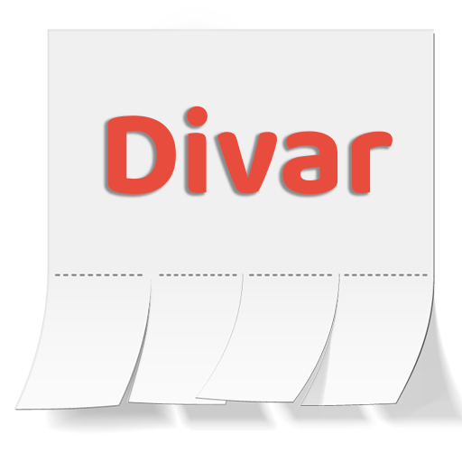
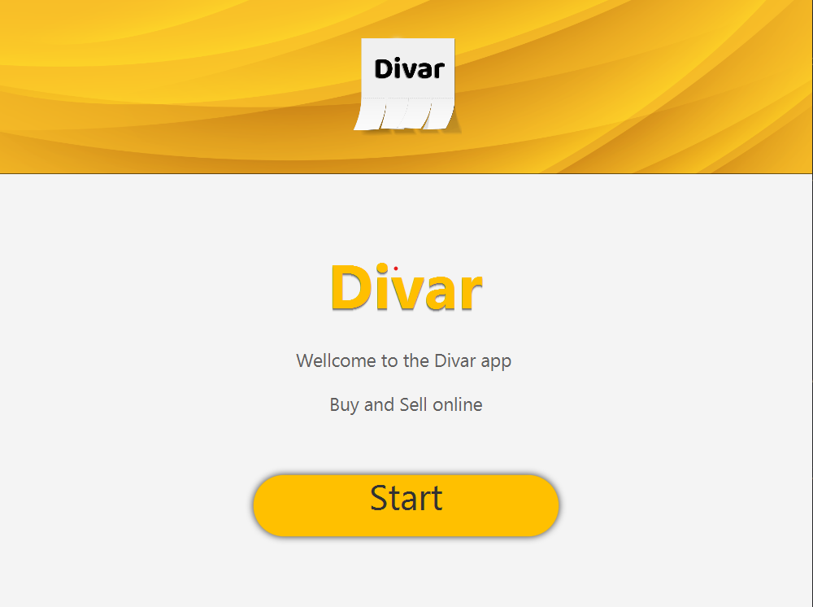

# Divar desktop app

  

## Developers

**Update Galaxy team:**
- [**Mohammad Rouintan**](https://github.com/MohammadRouintan)
- [**Abolfazl Ramezanian**](https://github.com/abolfazl30not30)
- [**Mahdi Ahmadi**](https://github.com/mr-robber)
- [**Reza Mosavi**](https://github.com/rezamosavi8740)
\
  \
  _Computer Science students at Shahid Beheshti University_
  \
  Mathematical sciences' faculty
  
### Summary
This project is developed as the final project for our advanced Java programming course at SBU.
\
Our application is meant to be a template of Divar desktop application.
### Features
  
- __**Graphical User Interface**__
  \
  \
  contains an impressive GUI, designed and implemented by JavaFX technology

  -  _login and sign up_
  
    

      
    

    

      
    

    

      
    

  - _All Ads Section_
    

      
    

  
  - -full View of Ads-
    

      
    

    
    

      
    

    
  - _Categories Section_
    

      
    

    
  - _Add Ads Section_
    

      
    

  
    

      
    

    
  - _Chat Section_
    

      
    

   - _My Divar Section_
    

      
    

   - -Saved Section-
    

      
    

- __**Object-orientation**__

this project is implemented in an absolutely object-oriented approach. since we used Java for this project,
we tried to use the full power of Java in terms of object orientation. the project is very well organized and maintainable
because every part of the program is developed within a separate package obviously-named. Each package consists of 
classes and fxml files of its own. we tried to obey the SOLID rules as much as we could in this project.

- __**Version Control tools**__

Our team work was organized and merged and developed upon Git and we made separate branches for different kind of tasks
and after implementing an specific part of the project the team members would push the changes and notifying the
maintainer of the project to merge their changes after checking their provided code.

- __**Database**__

For this project MongoDB database is used for storing data on server.
\
Here is the schema:

  

- __**Socket Programming**__

This project consists of two different applications, a client app and a server app developed by the socket programming tools and 
concpets in Java

- __**Multi-threading**__

To handle numerous clients simultaneously on server-side multi-threading concepts are used. clients are 
handled by being passed to a threadpool and shared methods between multiple threads are synchronized to avoid 
the race condition and data loss